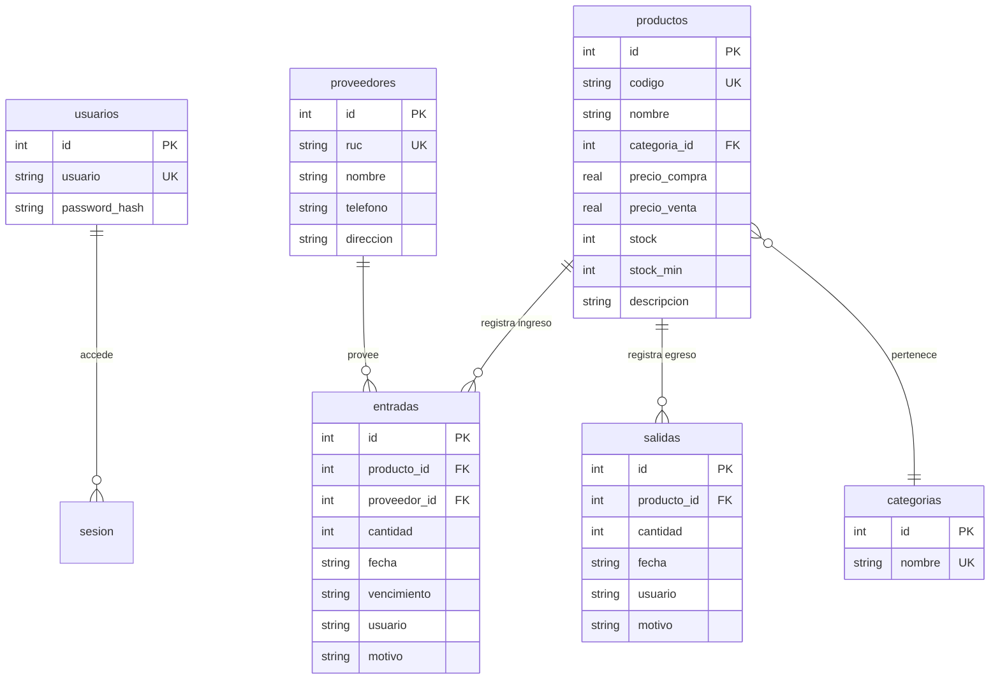

# Documentacion Tecnica del Sistema de Inventario para Minimarket

**Proyecto:** Sistema de Gestion de Inventario -- Minimarket "Don Jose"  
**Tecnologia Principal:** Python, Flask, SQLite, HTML5, CSS3 (Modular) y JavaScript (ES6)  
**Autor/Repositorio:** [rlaur205/gestion-inventario-flask](https://github.com/rlaur205/gestion-inventario-flask)

---

## 1. Descripcion General del Sistema

El **Sistema de Gestion de Inventario para Minimarket** es una aplicacion web responsiva disenada para optimizar y controlar el flujo de productos en comercios minoristas. Permite administrar de forma centralizada el catalogo de productos y la base de datos de proveedores, monitorear los niveles de existencias, registrar entradas y salidas (ventas o consumo interno) y visualizar metricas clave mediante un panel interactivo (Dashboard).

El sistema cuenta con un diseno minimalista y moderno, control de acceso mediante credenciales de seguridad, validaciones automaticas de stock minimo, seguimiento de lotes con fecha de vencimiento y un registro historico estructurado (Kardex).

---

## 2. Estructura y Organizacion del Proyecto

El proyecto esta disenado bajo una arquitectura limpia y modular en Flask, separando las responsabilidades de enrutamiento (Blueprints), base de datos (Models), estilos visuales (CSS) y logica del cliente (JS).

```
gestion-minimarket/
│
├── app.py               # Punto de entrada y configuracion de la app Flask (factory create_app)
├── config.py            # Configuracion de variables globales y rutas del sistema (DB_PATH)
├── base.html            # Template base Jinja2 (sidebar, topbar, carga de assets globales)
├── reset_db.py          # Script de utilidad para inicializar o reiniciar las tablas en SQLite
├── inventario.db        # Archivo fisico de la base de datos SQLite (se genera localmente)
├── .env                 # Variables de entorno (SECRET_KEY)
├── requirements.txt     # Dependencias fijas del proyecto
├── stress_test.py       # Script de carga para pruebas de rendimiento
│
├── login/               # Pagina de autenticacion (independiente, no hereda de base.html)
│   ├── login.html       #   Interfaz de inicio de sesion (split-panel con formulario)
│   ├── login.css        #   Estilos de la pantalla de login (modo oscuro + glassmorphism)
│   └── login.js         #   Validacion cliente, toggle de contrasena y ripple en boton
│
├── imgs/                # Capturas de pantalla e imagenes ilustrativas del sistema
│
├── errors/              # Paginas de error personalizadas
│   ├── 404.html         #   Pagina no encontrada
│   └── 500.html         #   Error interno del servidor
│
├── models/              # Modelos y utilidades de la base de datos
│   └── db.py            #   Funcion get_db() para gestionar la conexion SQLite
│
├── rutas/               # Controladores agrupados en Blueprints (Rutas y endpoints)
│   ├── __init__.py      #   Inicializador del paquete de rutas
│   ├── api.py           #   Endpoints JSON publicos (/api/products, /api/providers, /api/categorias)
│   ├── auth.py          #   Rutas de autenticacion (Login, Logout y manejo de sesion)
│   ├── dashboard_api.py #   Endpoints JSON del dashboard (/api/dashboard, /api/recent-activity)
│   ├── movimientos.py   #   Registro de entradas, salidas y consulta de historial
│   ├── operaciones.py   #   Ruta /operaciones (pagina de entrada/salida de stock)
│   ├── productos.py     #   Rutas del catalogo: dashboard (/), /productos, /add_product, editar, DELETE
│   └── proveedores.py   #   Rutas de proveedores: /proveedores, /add_provider, editar, DELETE
│
├── pages/               # Vistas organizadas por pagina (patron modular tipo widget)
│   ├── administrador/   #   Dashboard principal (panel de control)
│   │   ├── administrador.html
│   │   ├── administrador.css
│   │   ├── administrador.js
│   │   ├── grafico/           # Grafico Chart.js con toggle Categorias/Productos
│   │   ├── kpi_card/          # Tarjetas KPI (total productos, alertas, valor, vencimientos)
│   │   ├── resumen_tablas/    # Mini-tablas laterales (productos + proveedores)
│   │   └── actividad_reciente/# Modal de actividad reciente + pulso de inventario
│   │
│   ├── productos/       #   Gestion de catalogo de productos
│   │   ├── productos.html
│   │   ├── productos.css
│   │   ├── productos.js
│   │   ├── tabla_productos/  # Tabla completa con busqueda en caliente y eliminacion
│   │   └── nuevo_producto/   # Formulario de registro/edicion de productos
│   │
│   ├── proveedores/     #   Gestion de proveedores
│   │   ├── proveedores.html
│   │   ├── proveedores.css
│   │   ├── proveedores.js
│   │   ├── tabla_proveedores/ # Tabla de proveedores
│   │   └── nuevo_proveedor/   # Formulario de registro/edicion de proveedores
│   │
│   ├── operaciones/     #   Registro de entradas y salidas de stock
│   │   ├── operaciones.html
│   │   ├── operaciones.css
│   │   ├── operaciones.js
│   │   ├── registrar_entrada/ # Formulario de entrada de mercancia
│   │   └── registrar_salida/  # Formulario de salida de mercancia
│   │
│   └── historial/       #   Kardex de movimientos
│       ├── historial.html
│       ├── historial.css
│       ├── historial.js
│       └── tabla_movimientos/ # Tabla unificada entradas+salidas con buscador
│
├── static/              # Recursos estaticos servidos directamente al cliente
│   ├── css/             #   Hojas de estilo globales (entrypoint: main.css)
│   │   ├── main.css       #   Archivo de importaciones generales
│   │   ├── base.css       #   Variables CSS (tokens), reset, page-shell, topbar, responsive, modo oscuro
│   │   ├── sidebar.css    #   Barra lateral colapsable con navegacion
│   │   ├── components.css #   Cards, botones, badges, modales, toasts, inputs
│   │   └── tables.css     #   Formato de tablas de datos e historial
│   │
│   └── js/              #   JavaScript compartido entre todas las paginas
│       ├── utils.js       #   Funciones comunes (modales, toasts, postForm, confirmar, buildOptions)
│       ├── ui.js          #   Sidebar toggle, cierre de modales (click/Escape)
│       └── main.js        #   Listeners globales (boton refresh, actividad reciente, toggle oscuro)
│
├── tests/               # Suite de pruebas automatizadas
│   ├── conftest.py      #   Configuracion de pytest (app test, DB temporal con seed)
│   ├── test_api.py      #   Tests de endpoints JSON
│   ├── test_auth.py     #   Tests de autenticacion
│   ├── test_stress.py   #   Test de estres (500 productos, 6 endpoints)
│   ├── test_validaciones.py # Tests de validacion de formularios
│   └── test_e2e.py      #   Tests end-to-end (flujos completos)
```

---

## 3. Base de Datos (SQLite)

El sistema utiliza una base de datos **SQLite3** local, configurada a traves de `config.py` y controlada mediante el script `reset_db.py`. El esquema consta de **6 tablas relacionales**:



### 3.1 Detalle de Tablas

#### Tabla: `usuarios`
Almacena las credenciales de acceso con hash bcrypt.
- `id`: Clave primaria autoincrementable.
- `usuario`: Nombre de usuario, restriccion UNIQUE.
- `password_hash`: Hash de contrasena generado con `bcrypt.hashpw()`.

#### Tabla: `categorias`
Catalogo de categorias para clasificar productos.
- `id`: Clave primaria autoincrementable.
- `nombre`: Nombre de la categoria (ej. "Abarrotes", "Bebidas", "Limpieza"), restriccion UNIQUE.
- Seed inicial: 25 categorias por defecto (Abarrotes, Bebidas, Lacteos, Panaderia, etc.).

#### Tabla: `productos`
Almacena el catalogo de productos con sus especificaciones monetarias e indicadores de alerta de stock.
- `id`: Clave primaria autoincrementable.
- `codigo`: Identificador unico legible del producto (ej. `PROD001`), restriccion UNIQUE.
- `nombre`: Nombre del producto.
- `categoria_id`: Clave foranea referenciando a `categorias(id)`.
- `precio_compra`: Precio pagado al adquirir una unidad (para calculo de valor total).
- `precio_venta`: Precio de venta sugerido al publico.
- `stock`: Cantidad actual en almacen (inicia en `0`, se modifica a traves de movimientos).
- `stock_min`: Limite minimo configurado para disparar la alerta visual en el Dashboard.
- `descripcion`: Informacion complementaria opcional.

#### Tabla: `proveedores`
Almacena los datos de contacto de las empresas proveedoras.
- `id`: Clave primaria autoincrementable.
- `ruc`: Identificador tributario unico (RUC o DNI), restriccion UNIQUE.
- `nombre`: Razon social o nombre comercial.
- `telefono`: Canal telefonico de contacto.
- `direccion`: Domicilio comercial.

#### Tabla: `entradas`
Registra los ingresos fisicos de mercancia al almacen.
- `id`: Clave primaria autoincrementable.
- `producto_id`: Clave foranea referenciando a `productos(id)`.
- `proveedor_id`: Clave foranea referenciando a `proveedores(id)`.
- `cantidad`: Cantidad de unidades que ingresan (debe ser mayor a `0`).
- `fecha`: Marca de tiempo en formato ISO 8601 del registro.
- `vencimiento`: Fecha de caducidad asociada al lote de entrada (por defecto `2099-12-31` si no requiere).
- `usuario`: Responsable de la carga (ej: "Almacenero").
- `motivo`: Comentario descriptivo de la operacion (ej: "Reposicion de Stock").

#### Tabla: `salidas`
Registra la salida fisica de mercancia por concepto de ventas, merma o consumos internos.
- `id`: Clave primaria autoincrementable.
- `producto_id`: Clave foranea referenciando a `productos(id)`.
- `cantidad`: Cantidad de unidades retiradas (validada previamente contra las existencias).
- `fecha`: Marca de tiempo en formato ISO 8601 de la transaccion.
- `usuario`: Vendedor o cajero responsable.
- `motivo`: Motivo del egreso ("Venta al publico", "Consumo interno", "Merma/Vencido", etc.).

---

## 4. Autenticacion y Seguridad

El sistema implementa un esquema de seguridad con contrasenas hasheadas en base de datos (bcrypt) y sesiones cifradas de Flask para restringir el acceso a usuarios no autenticados.


- **Credenciales por Defecto:**
    - **Usuario:** `admin`
    - **Contrasena:** `12345`
- **Hash de Contrasena:** Las contrasenas se almacenan con `bcrypt.hashpw()` y se verifican con `bcrypt.checkpw()`. El usuario por defecto se crea en `reset_db.py`.
- **Manejo de Sesion:** Cuando el inicio de sesion es exitoso, se establece la cookie firmada `session["autenticado"] = True` y `session["usuario"]` con el nombre del usuario.
- **SECRET_KEY:** Se lee desde el archivo `.env` mediante `python-dotenv`. Si no existe, se genera una por defecto en `config.py`.
- **Proteccion de Rutas Centralizada:**
    El sistema implementa un interceptor dinamico mediante el decorador `@app.before_request`:
    ```python
    @app.before_request
    def require_login():
        rutas_publicas = {"auth.login", "static", "scrn_assets"}
        if request.blueprint in ("api", "dashboard_api"):
            return
        if not session.get("autenticado"):
            if request.endpoint not in rutas_publicas:
                return redirect(url_for("auth.login"))
    ```
- **Excepciones Publicas:** Los blueprints `api` y `dashboard_api`, la carpeta `static`, la ruta `/scrn/` (assets de paginas) y `/login` estan configurados como acceso libre. El resto de rutas redirigen a `/login` si no hay sesion activa.
- **CSRF:** Todos los formularios POST incluyen un token CSRF generado por Flask-WTF. El archivo `utils.js` contiene la funcion `postForm()` que automaticamente incluye el token en `window.csrf_token` al enviar datos.
- **Manejo de Errores:** Paginas personalizadas para 404 y 404.html y 500.html en la carpeta `errors/`. Los errores de base de datos se registran en `app.log` y se retorna un JSON con `{"ok": false, "msg": "..."}`.

---

## 5. Arquitectura de Rutas (API y Controladores)

La aplicacion Flask se organiza utilizando **Blueprints** para agrupar rutas segun su funcion y modularizar el codigo del servidor.

### 5.1 Rutas de Autenticacion (`rutas/auth.py`)

| Metodo | Ruta | Funcion | Descripcion | Respuesta |
| :--- | :--- | :--- | :--- | :--- |
| **GET** | `/login` | `login()` | Renderiza el formulario web de inicio de sesion. | `HTML` |
| **POST** | `/login` | `login()` | Valida las credenciales enviadas contra la DB con bcrypt. | Redireccion o `Flash Message` |
| **GET** | `/logout` | `logout()` | Limpia las variables de sesion y redirige al login. | Redireccion a `/login` |

### 5.2 Rutas de Catalogo de Productos (`rutas/productos.py`)

| Metodo | Ruta | Funcion | Descripcion | Respuesta |
| :--- | :--- | :--- | :--- | :--- |
| **GET** | `/` | `index()` | Pagina principal del dashboard. Envia lista de productos. | `HTML` (Jinja2) |
| **GET** | `/productos` | `productos_page()` | Pagina de gestion de catalogo de productos. | `HTML` (Jinja2) |
| **POST** | `/add_product` | `add_product()` | Registra un nuevo producto validando unicidad de codigo. | `JSON`: `{"ok": true, "msg": "..."}` |
| **GET** | `/producto/<codigo>` | `obtener_producto()` | Obtiene datos de un producto por codigo (para editar). | `JSON`: `{"ok": true, "producto": {...}}` |
| **POST** | `/editar_producto/<codigo>` | `editar_producto()` | Actualiza los datos de un producto existente. | `JSON`: `{"ok": true, "msg": "..."}` |
| **DELETE** | `/producto/<codigo>` | `eliminar_producto()` | Elimina fisicamente un producto segun su codigo. | `JSON`: `{"ok": true, "msg": "..."}` |
| **POST** | `/add_categoria` | `add_categoria()` | Crea una nueva categoria (usado desde el formulario de producto). | `JSON`: `{"ok": true, "id": N, "nombre": "..."}` |
| **GET** | `/api/categorias` | `listar_categorias()` | Lista todas las categorias disponibles. | `JSON`: `[{"id": N, "nombre": "..."}]` |

### 5.3 Rutas de Movimientos e Historial (`rutas/movimientos.py`)

| Metodo | Ruta | Funcion | Descripcion | Respuesta |
| :--- | :--- | :--- | :--- | :--- |
| **POST** | `/add_entry` | `add_entry()` | Agrega unidades al stock y registra la compra. | `JSON`: `{"ok": true, "msg": "..."}` |
| **POST** | `/add_output` | `add_output()` | Valida stock actual y descuenta unidades registrando venta. | `JSON`: `{"ok": true, "msg": "..."}` |
| **GET** | `/historial` | `historial()` | Renderiza el Kardex unificado de movimientos. | `HTML` (Jinja2) |

### 5.4 Rutas de Proveedores (`rutas/proveedores.py`)

| Metodo | Ruta | Funcion | Descripcion | Respuesta |
| :--- | :--- | :--- | :--- | :--- |
| **GET** | `/proveedores` | `proveedores_page()` | Pagina de gestion de proveedores. | `HTML` (Jinja2) |
| **POST** | `/add_provider` | `add_provider()` | Registra un nuevo proveedor validando unicidad de RUC. | `JSON`: `{"ok": true, "msg": "..."}` |
| **GET** | `/proveedor/<int:id>` | `obtener_proveedor()` | Obtiene datos de un proveedor por ID (para editar). | `JSON`: `{"ok": true, "proveedor": {...}}` |
| **POST** | `/editar_proveedor/<int:id>` | `editar_proveedor()` | Actualiza los datos de un proveedor existente (RUC no editable). | `JSON`: `{"ok": true, "msg": "..."}` |
| **DELETE** | `/proveedor/<int:id>` | `eliminar_proveedor()` | Elimina un proveedor si no tiene entradas asociadas. | `JSON`: `{"ok": true/false, "msg": "..."}` |

### 5.5 Rutas de Operaciones (`rutas/operaciones.py`)

| Metodo | Ruta | Funcion | Descripcion | Respuesta |
| :--- | :--- | :--- | :--- | :--- |
| **GET** | `/operaciones` | `operaciones()` | Pagina de registro de entradas y salidas de stock. | `HTML` (Jinja2) |

### 5.6 Endpoints JSON de la API (`rutas/api.py` y `rutas/dashboard_api.py`)
Todas las rutas de este bloque inician automaticamente con el prefijo `/api` por configuracion del Blueprint.

| Metodo | Ruta | Blueprint | Funcion | Descripcion | Respuesta |
| :--- | :--- | :--- | :--- | :--- | :--- |
| **GET** | `/api/products` | `api` | `api_products()` | Lista los productos registrados para rellenar selects. | `JSON` (`[{id, codigo, nombre, stock}]`) |
| **GET** | `/api/providers` | `api` | `api_providers()` | Lista los proveedores registrados para rellenar selects. | `JSON` (`[{id, ruc, nombre}]`) |
| **GET** | `/api/categorias` | `api` | `listar_categorias()` | Lista las categorias para rellenar selects. | `JSON` (`[{id, nombre}]`) |
| **GET** | `/api/dashboard` | `dashboard_api` | `api_dashboard()` | Retorna metricas analiticas (totales, alertas, valor, distribucion por categoria, stock por producto). | `JSON` |
| **GET** | `/api/recent-activity` | `dashboard_api` | `api_recent_activity()` | Retorna los ultimos 12 movimientos (entradas + salidas) con fecha formateada. | `JSON` |

---

## 6. Detalles Tecnologicos del Frontend

La interfaz de usuario ha sido renovada bajo una estetica premium moderna y limpia, utilizando CSS puro y estructurado de forma modular, apoyada con JavaScript moderno (ES6).

### 6.1 Modo Oscuro

El sistema incluye un **modo oscuro** activable mediante un boton (sol/luna) en la barra superior (topbar). El estado se persiste en `localStorage`.

- Se implementa con un atributo `data-theme="dark"` en la etiqueta `<html>`.
- Las variables CSS en `:root` y `[data-theme="dark"]` invierten los colores (fondos oscuros, texto claro).
- El toggle escucha clicks en `#darkModeToggle` y aplica `document.documentElement.setAttribute("data-theme", ...)`.
- Al cargar la pagina, se lee `localStorage.getItem("theme")` para restaurar la preferencia.
- Se aplica tanto en la pagina de login (`login.css`) como en la aplicacion principal (`base.css`, `sidebar.css`, `components.css`).

### 6.2 Confirmacion de Eliminacion

Las acciones destructivas (eliminar producto o proveedor) muestran un **modal de confirmacion** personalizado antes de ejecutar la peticion DELETE.

- Funcion `confirmar(mensaje)` en `utils.js` que retorna una `Promise`.
- Renderiza un modal con fondo semitransparente, mensaje y dos botones (Confirmar / Cancelar).
- Al confirmar, resuelve la promesa; al cancelar, la rechaza.
- Ejemplo de uso:
  ```javascript
  if (await confirmar("¿Eliminar producto?")) {
      postForm(url, data, onOk, onError);
  }
  ```

### 6.3 Formularios en linea (por pagina)

Cada pagina tiene sus formularios directamente en su HTML, sin usar modales dinamicos inyectados desde JavaScript. Los formularios se incluyen mediante `` y se envian asincronamente con `postForm()`, evitando recargas de pagina.

Las funciones de utilidad `cerrarModal()`, `abrirModal(html)`, `showToast(msg, type)`, `confirmar(mensaje)` y `postForm(url, data, onOk, onError)` viven en `static/js/utils.js` y se usan desde cualquier widget que lo necesite.

#### Formularios del Sistema

A continuacion se muestran las capturas de las interfaces de formularios implementadas:

- **Nuevo Producto:** Formulario dinamico para registrar productos en el catalogo. Incluye un selector de categorias con opcion "+" para crear una nueva categoria sobre la marcha.
    

- **Nuevo Proveedor:** Formulario para registrar datos de contacto del proveedor.
    

- **Registrar Entrada de Stock:** Modal que carga asincronamente productos y proveedores en paralelo mediante `Promise.all`.
    

- **Registrar Salida de Stock:** Formulario para registrar salidas con validacion de stock disponible.
    

### 6.4 Edicion en Linea (Productos y Proveedores)

Los formularios de producto y proveedor soportan dos modos: **creacion** y **edicion**.

- **Modo edicion**: se activa al hacer clic en el boton "Editar" de la tabla. El JavaScript carga los datos del registro via GET (`/producto/<codigo>` o `/proveedor/<id>`), llena el formulario y cambia la URL de envio a `/editar_producto/<codigo>` o `/editar_proveedor/<id>`.
- El modo se controla mediante `dataset.editCodigo` (productos) o `dataset.editId` (proveedores) en el formulario.
- En la edicion de productos, la categoria se preselecciona en el `<select>`.
- En la edicion de proveedores, el campo RUC se deshabilita (no se puede modificar).
- Al guardar, el formulario se envia a la ruta de edicion correspondiente y se refresca la tabla.

### 6.5 Comunicacion Asincrona (`postForm()`)

El envio de los formularios se realiza asincronamente mediante `fetch` con la funcion `postForm(url, data, onOk, onError)`:
- Serializa los objetos de JavaScript como `URLSearchParams` para que Flask los reciba en el diccionario tradicional `request.form`.
- Incluye automaticamente el token CSRF en `window.csrf_token`.
- Muestra notificaciones dinamicas (Toast Notifications) creadas dinamicamente en el DOM (`showToast()`) en lugar de recargar la pagina ante fallos.
- En caso de exito, muestra el aviso de confirmacion y recarga la interfaz tras un retraso controlado (`1.2 segundos`) para reflejar los cambios en el almacen.

### 6.6 Dashboard Dinamico con Chart.js

El script `pages/administrador/grafico/grafico.js` se encarga de consultar `/api/dashboard` de forma asincrona y dibujar un grafico de barras con Chart.js. Chart.js solo se carga en la pagina del dashboard (no en el resto del sitio).
- **Metricas KPI:** Actualiza dinamicamente el total de productos, las alertas criticas, la cantidad de lotes por vencer y el valorizado del inventario.
- **Conmutacion del Grafico:** Mediante botones alternadores, cambia el dataset del grafico de barras de Chart.js en caliente sin destruir la estructura CSS de la tarjeta. Permite visualizar:
    - *Categorias:* Cantidad de productos registrados en cada categoria del catalogo.
    - *Stock:* Cantidad fisica disponible de los productos con mayor precio de venta.
- **Configuracion Visual del Grafico:** Utiliza barras con esquinas redondeadas (`borderRadius: 10`), paleta de colores minimalista (`#18181b` con hover en `#000000`) y fuentes cargadas desde Google Fonts (`Geist`).

#### Vistas del Dashboard Principal
El Dashboard cuenta con multiples vistas interactivas configurables en caliente:

- **Vista de Metricas y Categorias:**
    
- **Vista de Stock por Producto:**
    
- **Detalle del Panel Lateral e Indicadores de Alerta:**
    

### 6.7 Buscador en Caliente (Busqueda por DOM) y Tablas

Para optimizar las consultas a la base de datos, las busquedas en la tabla de productos (`productos.html`) e historial (`historial.html`) se realizan en el cliente (DOM) mediante la evaluacion de eventos `input` en tiempo real. 
Al escribir en la caja de texto, se evalua si cada fila `<tr>` contiene la cadena de busqueda (pasando todo a minusculas) y se ocultan los elementos no coincidentes utilizando `display = "none"`.

#### Interfaz de Tablas del Sistema

- **Tabla de Catalogo de Productos:**
    

- **Kardex / Historial de Cambios:**
    

---

## 7. Pruebas y Calidad de Codigo

### 7.1 Suite de Tests (33 tests)

El proyecto incluye una suite de pruebas automatizadas con **pytest** y **pytest-cov**:

| Archivo | Tests | Descripcion |
|---------|-------|-------------|
| `tests/test_auth.py` | 5 | Login exitoso, credenciales invalidas, logout, redireccion sin sesion, proteccion de rutas |
| `tests/test_api.py` | 8 | Endpoints JSON: productos, proveedores, dashboard, actividad reciente |
| `tests/test_validaciones.py` | 14 | Validacion de formularios: campos vacios, duplicados, stock, fechas, cantidades |
| `tests/test_stress.py` | 2 | Insercion masiva (500 productos), 6 endpoints bajo carga |
| `tests/test_e2e.py` | 3 | Flujos completos: producto->entrada->dashboard, proveedor->entrada->historial, salida->stock->movimiento |
| `tests/conftest.py` | - | Fixture de app test, DB temporal con schema completo + seed de 25 categorias |

**Cobertura:** ~77% (metricas calculadas con `pytest-cov`).

**Ejecucion:**
```bash
pytest                              # Todos los tests
pytest --cov=. --cov-report=term    # Con reporte de cobertura
pytest tests/test_stress.py         # Test de estres unicamente
pytest tests/test_e2e.py -v         # Tests end-to-end (verbose)
```

### 7.2 Calidad de Codigo

El codigo ha sido verificado con las siguientes herramientas:

| Herramienta | Estado | Detalle |
|-------------|--------|---------|
| **ruff** | 0 errores | Linter de Python, 0 errores, 0 warnings |
| **black** | 20/20 archivos formateados | Formateador de codigo, sin violaciones |
| **radon cc** | Complejidad A/B | Complejidad ciclomatica mayormente baja (A) |
| **radon mi** | A (65-100) | Maintainability Index alto en todos los modulos |
| **bandit** | 1 HIGH, 1 MEDIUM | Falsos positivos por hardcoded password en reset_db.py (intencional para seed) |

**Ejecucion:**
```bash
ruff check .
black --check .
radon cc . -s
radon mi . -s
bandit -r .
```

---

## 8. Despliegue, Instalacion y Ejecucion

### Requisitos Tecnicos
- Python 3.8 o superior.
- Administrador de paquetes `pip` de Python.
- Conexion a internet para la carga inicial de fuentes y librerias desde CDNs (Chart.js, Google Fonts).

### Guia de Inicio Rapido
1.  **Preparar el Repositorio:**
    ```bash
    git clone https://github.com/rlaur205/gestion-inventario-flask.git
    cd gestion-inventario-flask
    ```
2.  **Instalar Dependencias:**
    ```bash
    pip install -r requirements.txt
    ```
3.  **Configurar Variable de Entorno:**
    ```bash
    echo "SECRET_KEY=$(python3 -c 'import secrets; print(secrets.token_hex(32))')" > .env
    ```
4.  **Generar Tablas de la Base de Datos:**
    ```bash
    python3 reset_db.py
    ```
    > **Cuidado:** Ejecutar este comando restablece las tablas a cero y borra cualquier registro previo. Solo usarlo en la primera instalacion o al requerir una base de datos limpia de pruebas.
5.  **Iniciar Servidor de Desarrollo:**
    ```bash
    python3 app.py
    ```
6.  **Pruebas Locales:**
    Navegar a `http://127.0.0.1:5000` en cualquier navegador web.
    - **Usuario:** `admin`
    - **Contrasena:** `12345`

---

## 9. Consideraciones de Desarrollo y Mejoras Futuras

- **Peticiones Robustas:** Las respuestas del servidor se han homologado a respuestas de tipo JSON con la firma `{ "ok": true/false, "msg": "..." }` y codigos de estado HTTP apropiados (`400 Bad Request`, `404 Not Found`, `500 Internal Server Error`).
- **Lotes y Vencimientos:** Las fechas de vencimiento estan controladas para lotes criticos; los productos que no expiran reciben la fecha de descarte `2099-12-31` de forma transparente.
- **Manejo de Errores:** Los errores de base de datos se capturan con try/except y se registran en `app.log`. Los errores de integridad referencial (FK) en eliminacion de proveedores se manejan con un mensaje amigable al usuario.
- **Propuestas de Escalabilidad:**
    1.  *Migracion de Base de Datos:* Migrar SQLite a una base de datos PostgreSQL o MySQL para entornos multiusuario con concurrencia real.
    2.  *Roles y Permisos:* Configurar roles (e.g. Administrador, Almacenero, Cajero) y restringir el acceso a ciertos modales basandose en las facultades del rol activo.
    3.  *Exportacion de Reportes:* Anadir exportacion nativa de reportes a PDF o plantillas Excel desde el historial de movimientos o el stock actual.
    4.  *Dockerizacion:* Empaquetar la aplicacion en un contenedor Docker para facilitar el despliegue en cualquier entorno.
    5.  *Type Hints:* Agregar anotaciones de tipo en todas las funciones de Python para mejorar la mantenibilidad y facilitar el autocompletado en IDEs.
