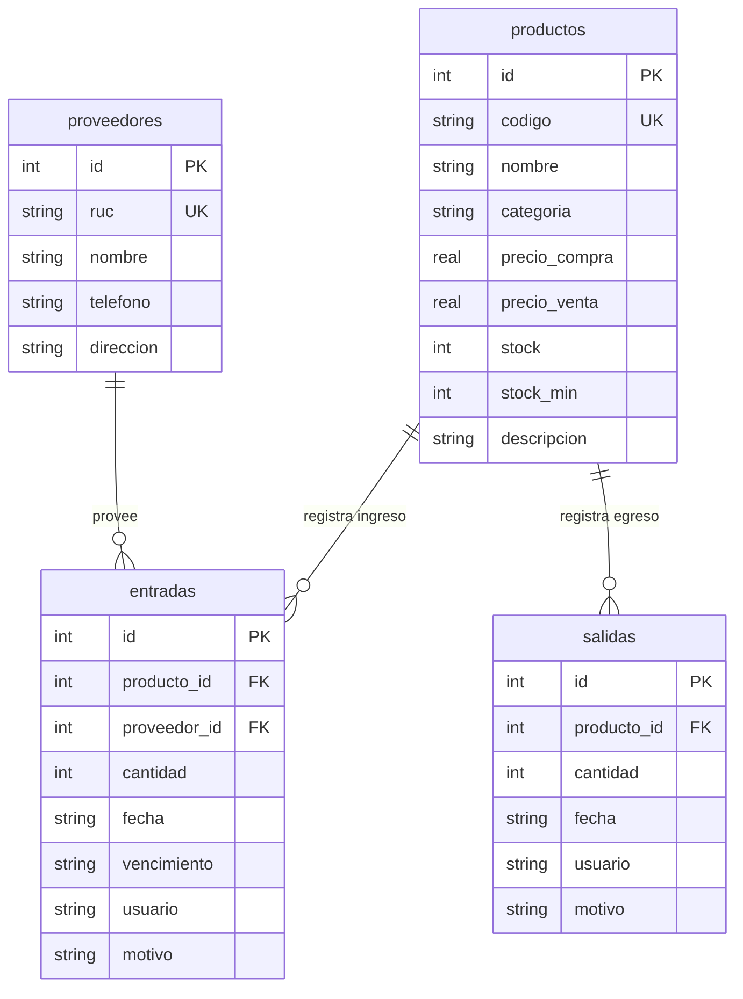

# 📦 Documentación Técnica del Sistema de Inventario para Minimarket

**Proyecto:** Sistema de Gestión de Inventario — Minimarket "Don José"  
**Tecnología Principal:** Python, Flask, SQLite, HTML5, CSS3 (Modular) y JavaScript (ES6)  
**Autor/Repositorio:** [rlaur205/inventario-colegio-flusk](https://github.com/rlaur205/inventario-colegio-flusk)

---

## 1. Descripción General del Sistema

El **Sistema de Gestión de Inventario para Minimarket** es una aplicación web responsiva diseñada para optimizar y controlar el flujo de productos en comercios minoristas. Permite administrar de forma centralizada el catálogo de productos y la base de datos de proveedores, monitorear los niveles de existencias, registrar entradas y salidas (ventas o consumo interno) y visualizar métricas clave mediante un panel interactivo (Dashboard).

El sistema cuenta con un diseño minimalista y moderno, control de acceso mediante credenciales de seguridad, validaciones automáticas de stock mínimo, seguimiento de lotes con fecha de vencimiento y un registro histórico estructurado (Kardex).

---

## 2. Estructura y Organización del Proyecto

El proyecto está diseñado bajo una arquitectura limpia y modular en Flask, separando las responsabilidades de enrutamiento (Blueprints), base de datos (Models), estilos visuales (CSS) y lógica del cliente (JS).

```
gestion-minimarket/
│
├── app.py               # Punto de entrada y configuración de la app Flask (factoría create_app)
├── config.py            # Configuración de variables globales y rutas del sistema (DB_PATH)
├── reset_db.py          # Script de utilidad para inicializar o reiniciar las tablas en SQLite
├── inventario.db        # Archivo físico de la base de datos SQLite (se genera localmente)
│
├── models/              # Modelos y utilidades de la base de datos
│   └── db.py            # Función get_db() para gestionar la conexión SQLite
│
├── rutas/               # Controladores agrupados en Blueprints (Rutas y endpoints)
│   ├── __init__.py      # Inicializador del paquete de rutas
│   ├── api.py           # Endpoints JSON para el dashboard y listados de la API
│   ├── auth.py          # Rutas de autenticación (Login, Logout y manejo de sesión)
│   ├── movimientos.py   # Registro de entradas, salidas y consulta de historial
│   ├── productos.py     # Rutas de administración y eliminación del catálogo de productos
│   └── proveedores.py   # Rutas para el registro de nuevos proveedores
│
├── static/              # Recursos estáticos servidos directamente al cliente
│   ├── css/             # Hojas de estilo estructuradas por módulos
│   │   ├── reset.css      # Limpieza y normalización de estilos del navegador
│   │   ├── tokens.css     # Variables de diseño (Colores HSL, fuentes, sombras y transiciones)
│   │   ├── base.css       # Estilos globales del documento y elementos básicos
│   │   ├── layout.css     # Estructura grid y posicionamiento de paneles principales
│   │   ├── sidebar.css    # Estilos de la barra lateral de navegación colapsable
│   │   ├── components.css # Estilos de botones, selectores, modales, toasts y badges
│   │   ├── dashboard.css  # Estilos para las tarjetas KPI y contenedores de gráficos
│   │   ├── tables.css     # Formato de las tablas de datos e historial
│   │   ├── login.css      # Estilos premium del portal de inicio de sesión
│   │   └── main.css       # Archivo de importaciones generales
│   │
│   └── js/              # Código JavaScript para interactividad en el cliente
│       ├── main.js        # Configura listeners globales y el buscador de productos
│       ├── utils.js       # Funciones comunes (gestión de modales, toasts y envío asíncrono POST)
│       ├── dashboard.js   # Maneja consultas HTTP a la API y dibuja gráficos con Chart.js
│       └── modales/       # Scripts individuales que renderizan y validan formularios dinámicos
│           ├── producto.js   # Modal para añadir productos y lógica para eliminar elementos
│           ├── proveedor.js  # Modal para registrar datos de proveedores
│           ├── entrada.js    # Modal para ingresar stock (solicita datos de productos/proveedores)
│           └── salida.js     # Modal para registrar salidas de stock con validación local
│
└── templates/           # Vistas en HTML renderizadas mediante el motor Jinja2
    ├── base.html        # Estructura base común (Sidebar, Topbar y carga secuencial de scripts)
    ├── index.html       # Panel de control (Dashboard, Gráficos y Tabla de Productos)
    ├── historial.html   # Vista del Kardex histórico de movimientos con buscador local
    └── login.html       # Interfaz de inicio de sesión para control de acceso
```

---

## 3. Base de Datos (SQLite)

El sistema utiliza una base de datos **SQLite3** local, configurada a través de `config.py` y controlada mediante el script `reset_db.py`. El esquema consta de **4 tablas relacionales**:



### 3.1 Detalle de Tablas

#### Tabla: `productos`
Almacena el catálogo de productos con sus especificaciones monetarias e indicadores de alerta de stock.
*   `id`: Clave primaria autoincrementable.
*   `codigo`: Identificador único legible del producto (e.g. `PROD001`), restricción `UNIQUE`.
*   `nombre`: Nombre del producto.
*   `categoria`: Categoría del producto (e.g. "Abarrotes", "Bebidas").
*   `precio_compra`: Precio pagado al adquirir una unidad (para cálculo de valor total).
*   `precio_venta`: Precio de venta sugerido al público.
*   `stock`: Cantidad actual en almacén (inicia en `0`, se modifica a través de movimientos).
*   `stock_min`: Límite mínimo configurado para disparar la alerta visual en el Dashboard.
*   `descripcion`: Información complementaria opcional.

#### Tabla: `proveedores`
Almacena los datos de contacto de las empresas proveedoras.
*   `id`: Clave primaria autoincrementable.
*   `ruc`: Identificador tributario único (RUC o DNI), restricción `UNIQUE`.
*   `nombre`: Razón social o nombre comercial.
*   `telefono`: Canal telefónico de contacto.
*   `direccion`: Domicilio comercial.

#### Tabla: `entradas`
Registra los ingresos físicos de mercancía al almacén.
*   `id`: Clave primaria autoincrementable.
*   `producto_id`: Clave foránea referenciando a `productos(id)`.
*   `proveedor_id`: Clave foránea referenciando a `proveedores(id)`.
*   `cantidad`: Cantidad de unidades que ingresan (debe ser mayor a `0`).
*   `fecha`: Marca de tiempo en formato ISO 8601 del registro.
*   `vencimiento`: Fecha de caducidad asociada al lote de entrada (por defecto `2099-12-31` si no requiere).
*   `usuario`: Responsable de la carga (ej: "Almacenero").
*   `motivo`: Comentario descriptivo de la operación (ej: "Reposición de Stock").

#### Tabla: `salidas`
Registra la salida física de mercancía por concepto de ventas, merma o consumos internos.
*   `id`: Clave primaria autoincrementable.
*   `producto_id`: Clave foránea referenciando a `productos(id)`.
*   `cantidad`: Cantidad de unidades retiradas (validada previamente contra las existencias).
*   `fecha`: Marca de tiempo en formato ISO 8601 de la transacción.
*   `usuario`: Vendedor o cajero responsable.
*   `motivo`: Motivo del egreso ("Venta al público", "Consumo interno", "Merma/Vencido", etc.).

---

## 4. Autenticación y Seguridad

El sistema implementa un esquema de seguridad simple mediante sesiones cifradas de Flask para restringir el acceso a usuarios no autenticados.

*   **Credenciales por Defecto:**
    *   **Usuario:** `admin`
    *   **Contraseña:** `12345`
*   **Manejo de Sesión:** Cuando el inicio de sesión es exitoso, se establece la cookie firmada `session["autenticado"] = True` y `session["usuario"] = "admin"`.
*   **Protección de Rutas Centralizada:**
    El sistema implementa un interceptor dinámico mediante el decorador `@app.before_request`:
    ```python
    @app.before_request
    def require_login():
        rutas_publicas = {"auth.login", "static"}
        # Si el endpoint pertenece al Blueprint de la API, se exime de autenticación
        if request.blueprint == "api":
            return
        if not session.get("autenticado"):
            if request.endpoint not in rutas_publicas:
                return redirect(url_for("auth.login"))
    ```
*   **Excepciones Públicas:** La carpeta `static` (CSS, JS, imágenes), la ruta `/login` y los endpoints del Blueprint de la `/api` están configurados para ser de libre consulta. Las demás rutas HTML redirigen automáticamente a `/login` si no se detecta sesión activa.

---

## 5. Arquitectura de Rutas (API y Controladores)

La aplicación Flask se organiza utilizando **Blueprints** para agrupar rutas según su función y modularizar el código del servidor.

### 5.1 Rutas de Autenticación (`rutas/auth.py`)

| Método | Ruta | Función | Descripción | Respuesta |
| :--- | :--- | :--- | :--- | :--- |
| **GET** | `/login` | `login()` | Renderiza el formulario web de inicio de sesión. | `HTML` |
| **POST** | `/login` | `login()` | Valida las credenciales enviadas y crea la sesión. | Redirección o `Flash Message` |
| **GET** | `/logout` | `logout()` | Limpia las variables de sesión y redirige al login. | Redirección a `/login` |

### 5.2 Rutas de Catálogo de Productos (`rutas/productos.py`)

| Método | Ruta | Función | Descripción | Respuesta |
| :--- | :--- | :--- | :--- | :--- |
| **GET** | `/` | `index()` | Página principal del dashboard. Envía lista de productos. | `HTML` (Jinja2) |
| **POST** | `/add_product` | `add_product()` | Registra un nuevo producto validando unicidad de código. | `JSON`: `{"ok": true, "msg": "..."}` |
| **DELETE**| `/producto/<codigo>` | `eliminar_producto()` | Elimina físicamente un producto según su código. | `JSON`: `{"ok": true, "msg": "..."}` |

### 5.3 Rutas de Movimientos e Historial (`rutas/movimientos.py`)

| Método | Ruta | Función | Descripción | Respuesta |
| :--- | :--- | :--- | :--- | :--- |
| **POST** | `/add_entry` | `add_entry()` | Agrega unidades al stock y registra la compra. | `JSON`: `{"ok": true, "msg": "..."}` |
| **POST** | `/add_output` | `add_output()` | Valida stock actual y descuenta unidades registrando venta. | `JSON`: `{"ok": true, "msg": "..."}` |
| **GET** | `/historial` | `historial()` | Renderiza el Kardex unificado de movimientos. | `HTML` (Jinja2) |

### 5.4 Rutas de Proveedores (`rutas/proveedores.py`)

| Método | Ruta | Función | Descripción | Respuesta |
| :--- | :--- | :--- | :--- | :--- |
| **POST** | `/add_provider` | `add_provider()` | Registra un nuevo proveedor validando unicidad de RUC. | `JSON`: `{"ok": true, "msg": "..."}` |

### 5.5 Endpoints JSON de la API (`rutas/api.py`)
Todas las rutas de este bloque inician automáticamente con el prefijo `/api` por configuración del Blueprint.

| Método | Ruta | Función | Descripción | Respuesta |
| :--- | :--- | :--- | :--- | :--- |
| **GET** | `/api/products` | `api_products()` | Lista los productos registrados para rellenar selects. | `JSON` (`[{id, codigo, nombre, stock}]`) |
| **GET** | `/api/providers` | `api_providers()` | Lista los proveedores registrados para rellenar selects. | `JSON` (`[{id, ruc, nombre}]`) |
| **GET** | `/api/dashboard` | `api_dashboard()` | Retorna métricas analíticas e información de gráficos. | `JSON` (Métricas + datasets de Chart.js) |

---

## 6. Detalles Tecnológicos del Frontend

La interfaz de usuario ha sido renovada bajo una estética premium moderna y limpia, utilizando CSS puro y estructurado de forma modular, apoyada con JavaScript moderno (ES6).

### 6.1 Lógica de Modales Dinámicos (`static/js/utils.js` y `modales/`)
El sistema utiliza ventanas modales dinámicas inyectadas directamente en un elemento contenedor `#modal-root`. Esto permite completar flujos de datos sin recargar la página.

1.  **Apertura e Inyección:** Al hacer clic en un botón operativo, se llama a una función (e.g. `openAddProduct()`) que contiene una plantilla HTML en forma de string. Esta se inyecta utilizando la función auxiliar `abrirModal(html)`.
2.  **Cierre:** La función `cerrarModal()` simplemente vacía el contenedor (`innerHTML = ""`).
3.  **Consultas Concurrentes (Promise.all):** Al abrir el modal de entradas, se deben rellenar selectores dinámicos de productos y proveedores de manera simultánea. Para evitar bloqueos, se usa `Promise.all` para lanzar ambos fetches en paralelo antes de renderizar el modal:
    ```javascript
    Promise.all([
      fetch("/api/products").then(r => r.json()),
      fetch("/api/providers").then(r => r.json())
    ]).then(([products, providers]) => { ... });
    ```

### 6.2 Comunicación Asíncrona (`postForm()`)
El envío de los formularios se realiza asíncronamente mediante `fetch` con la función `postForm(url, data, onOk, onError)`:
*   Serializa los objetos de JavaScript como `URLSearchParams` para que Flask los reciba en el diccionario tradicional `request.form`.
*   Muestra notificaciones dinámicas (Toast Notifications) creadas dinámicamente en el DOM (`showToast()`) en lugar de recargar la página ante fallos.
*   En caso de éxito, muestra el aviso de confirmación y recarga la interfaz tras un retraso controlado (`1.2 segundos`) para reflejar los cambios en el almacén.

### 6.3 Dashboard Dinámico con Chart.js
El script `static/js/dashboard.js` se encarga de consultar `/api/dashboard` de forma asíncrona:
*   **Métricas KPI:** Actualiza dinámicamente el total de productos, las alertas críticas, la cantidad de lotes por vencer y el valorizado del inventario.
*   **Conmutación del Gráfico:** Mediante botones alternadores, cambia el dataset del gráfico de barras de Chart.js en caliente sin destruir la estructura CSS de la tarjeta. Permite visualizar:
    *   *Categorías:* Cantidad de productos registrados en cada categoría del catálogo.
    *   *Stock:* Cantidad física disponible de los productos con mayor precio de venta.
*   **Configuración Visual del Gráfico:** Utiliza barras con esquinas redondeadas (`borderRadius: 10`), paleta de colores minimalista (`#18181b` con hover en `#000000`) y fuentes cargadas desde Google Fonts (`Geist`).

### 6.4 Buscador en Caliente (Búsqueda por DOM)
Para optimizar las consultas a la base de datos, las búsquedas en la tabla de inventario (`index.html`) e historial (`historial.html`) se realizan en el cliente (DOM) mediante la evaluación de eventos `input` en tiempo real. 
Al escribir en la caja de texto, se evalúa si cada fila `<tr>` contiene la cadena de búsqueda (pasando todo a minúsculas) y se ocultan los elementos no coincidentes utilizando `display = "none"`.

---

## 7. Despliegue, Instalación y Ejecución

### Requisitos Técnicos
*   Python 3.8 o superior.
*   Administrador de paquetes `pip` de Python.
*   Conexión a internet para la carga inicial de fuentes y librerías desde CDNs (Chart.js, Google Fonts).

### Guía de Inicio Rápido
1.  **Preparar el Repositorio:**
    ```bash
    git clone https://github.com/rlaur205/inventario-colegio-flusk.git
    cd inventario-colegio-flusk
    ```
2.  **Instalar Flask:**
    ```bash
    pip install flask
    ```
3.  **Generar Tablas de la Base de Datos:**
    ```bash
    python reset_db.py
    ```
    > 🔴 **Cuidado:** Ejecutar este comando restablece las tablas a cero y borra cualquier registro previo. Solo usarlo en la primera instalación o al requerir una base de datos limpia de pruebas.
4.  **Iniciar Servidor de Desarrollo:**
    ```bash
    python app.py
    ```
5.  **Pruebas Locales:**
    Navegar a `http://127.0.0.1:5000` en cualquier navegador web.

---

## 8. Consideraciones de Desarrollo y Mejoras Futuras

*   **Peticiones Robustas:** Las respuestas del servidor se han homologado a respuestas de tipo JSON con la firma `{ "ok": true/false, "msg": "..." }` y códigos de estado HTTP apropiados (`400 Bad Request`, `404 Not Found`, `500 Internal Server Error`).
*   **Lotes y Vencimientos:** Las fechas de vencimiento están controladas para lotes críticos; los productos que no expiran reciben la fecha de descarte `2099-12-31` de forma transparente.
*   **Propuestas de Escalabilidad:**
    1.  *Migración de Base de Datos:* Migrar SQLite a una base de datos PostgreSQL o MySQL para entornos multiusuario con concurrencia real.
    2.  *Autenticación Dinámica:* Sustituir el login estático por un sistema de usuarios almacenado en base de datos con contraseñas encriptadas mediante `werkzeug.security`.
    3.  *Roles y Permisos:* Configurar roles (e.g. Administrador, Almacenero, Cajero) y restringir el acceso a ciertos modales basándose en las facultades del rol activo.
    4.  *Generación de Reportes:* Añadir exportación nativa de reportes a PDF o plantillas Excel desde el historial de movimientos o el stock actual.
