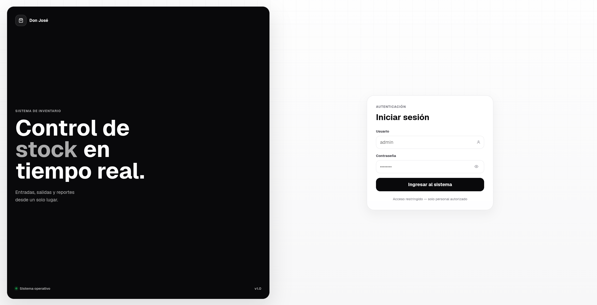
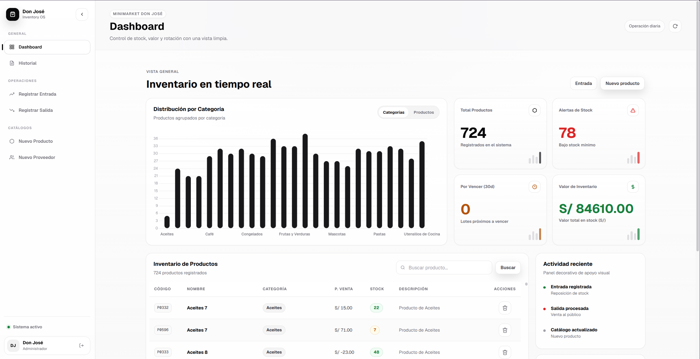
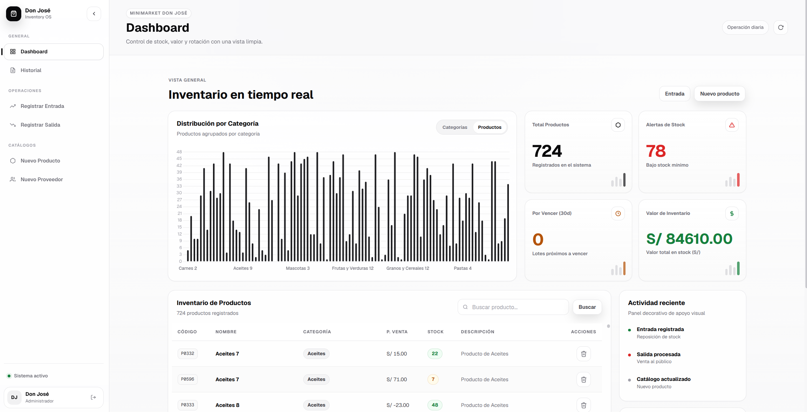
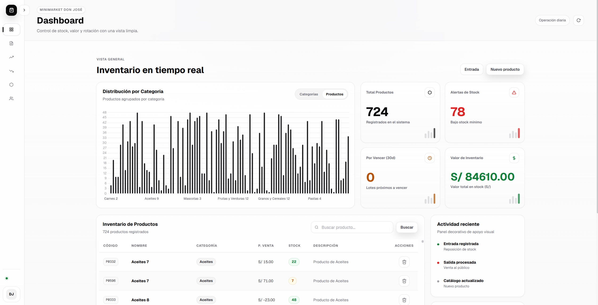
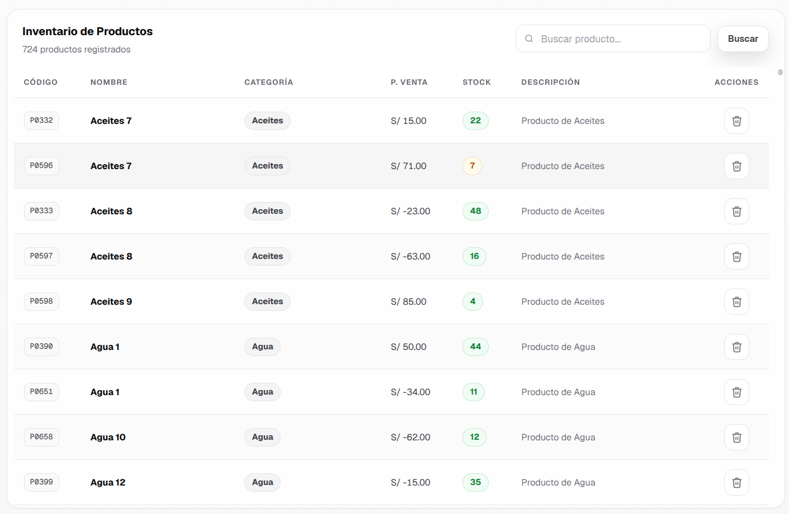
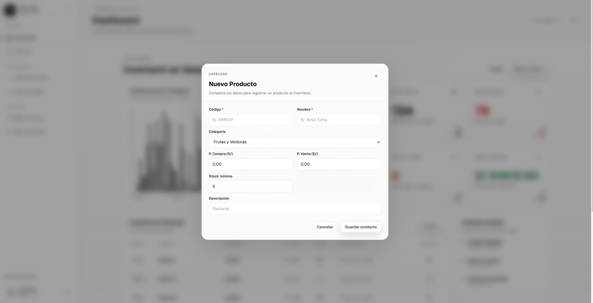
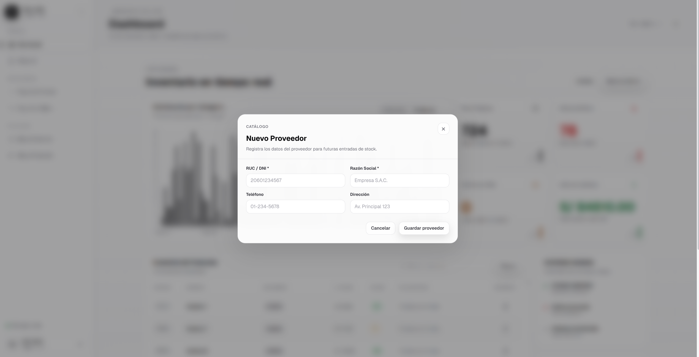
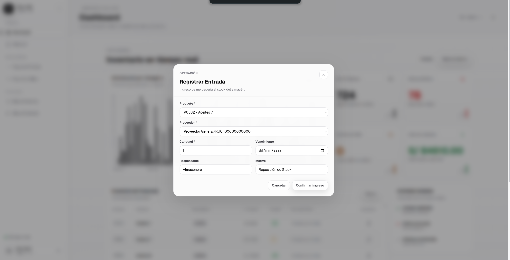
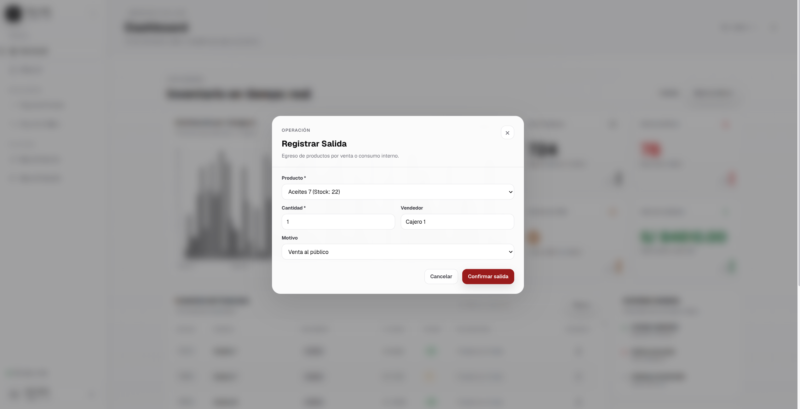
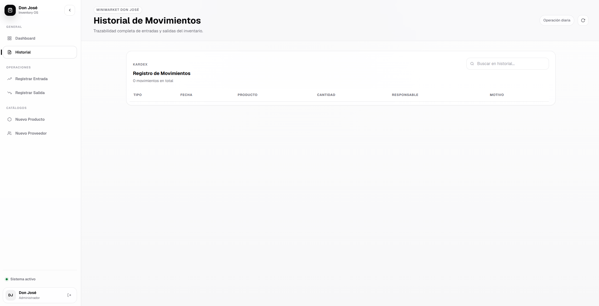

# 📦 Sistema de Gestión de Inventario para Minimarket — "Don José"

[](https://www.python.org/)
[](https://flask.palletsprojects.com/)
[](https://www.sqlite.org/)
[](https://opensource.org/licenses/MIT)

Una solución web moderna y profesional diseñada para el control y la administración de suministros en tiendas y pequeños negocios. Cuenta con un diseño premium optimizado, control de acceso mediante inicio de sesión, métricas del estado del inventario en tiempo real y gráficos interactivos.

---

## 📸 Vista de la Aplicación

El sistema cuenta con una interfaz renovada basada en la familia tipográfica **Geist**, micro-animaciones fluidas, un panel de login dedicado y una barra lateral de navegación estructurada.

### 🔐 Inicio de Sesión
Acceso restringido mediante cookies firmadas de sesión para personal autorizado.


### 📊 Panel de Control (Dashboard)
Tarjetas KPI que calculan automáticamente el valor total del almacén, alertas de stock mínimo y productos por vencer en los próximos 30 días.




### 📋 Gestión de Catálogo y Tablas
Visualización de productos con filtros de búsqueda instantánea en caliente por DOM.


### ➕ Formularios Modales y Operaciones
Registro rápido de productos, proveedores, entradas y salidas de stock sin recargas de página mediante JavaScript asíncrono (`fetch` API).

*   **Nuevo Producto:**
    

*   **Nuevo Proveedor:**
    

*   **Registrar Entrada de Stock:**
    

*   **Registrar Salida de Stock:**
    

### 📜 Historial de Cambios (Kardex)
Registro unificado de todos los movimientos (entradas y salidas) con buscador en tiempo real.


---

## ✨ Características Principales

*   🔒 **Seguridad y Autenticación:** Módulo de login con protección de rutas intermedia (`@app.before_request`) que restringe el acceso de forma global y permite cerrar sesión de manera segura.
*   📊 **Dashboard Analítico:** Tarjetas KPI de control y gráficos dinámicos interactivos de Chart.js con soporte de cambio de dataset en tiempo real.
*   📅 **Control de Vencimientos:** Monitoreo activo de lotes de productos perecederos próximos a caducar dentro de los siguientes 30 días.
*   💸 **Valorización del Inventario:** Cálculo del valor monetario total del almacén basado en el precio de adquisición (`stock * precio_compra`).
*   📦 **Gestión Inteligente de Stock (Entradas y Salidas):** 
    *   **Entradas:** Registro de compras especificando cantidad, proveedor y fecha de vencimiento.
    *   **Salidas:** Registro de ventas o consumos con validación de existencias en tiempo real para evitar stocks negativos.
*   🔎 **Buscadores Interactivos en Caliente:** Filtros instantáneos en la tabla de productos y de historial (Kardex) que procesan el texto en el DOM al escribir.
*   🗑️ **Mantenimiento Simplificado:** Eliminación directa de productos del catálogo desde la misma interfaz con actualización asíncrona.
*   ⚙️ **Diseño de Hojas de Estilo Modular:** Hojas de estilos divididas de forma estructurada (`tokens`, `reset`, `layout`, `components`, `sidebar`, `tables`, `dashboard`, `login`) para facilitar el mantenimiento y escalabilidad del frontend.

---

## 🛠️ Stack Tecnológico

*   **Backend:** Python 3.x & Flask (Estructurado mediante Blueprints)
*   **Base de Datos:** SQLite3 (Persistencia de datos local rápida y ligera)
*   **Frontend:** HTML5 (Plantillas Jinja2), CSS3 Modular (Variables de diseño en HSL) y JavaScript (ES6+, sin dependencias externas pesadas)
*   **Gráficos:** Chart.js (Mediante CDN)

---

## ⚙️ Instalación y Ejecución

Sigue estos sencillos pasos para levantar el entorno de desarrollo localmente:

1.  **Clona el repositorio:**
    ```bash
    git clone https://github.com/rlaur205/gestion-inventario-flask.git
    cd gestion-inventario-flask
    ```

2.  **Instala Flask:**
    ```bash
    pip install flask
    ```

3.  **Inicializa la base de datos (SQLite):**
    ```bash
    python reset_db.py
    ```
    > ⚠️ **Nota:** Esto creará el archivo `inventario.db` y las tablas necesarias con un proveedor general de prueba.

4.  **Ejecuta el servidor de desarrollo:**
    ```bash
    python app.py
    ```

5.  **Accede desde tu navegador:**
    Abre la dirección [http://localhost:5000](http://localhost:5000) e ingresa con las credenciales por defecto:
    *   **Usuario:** `admin`
    *   **Contraseña:** `12345`
